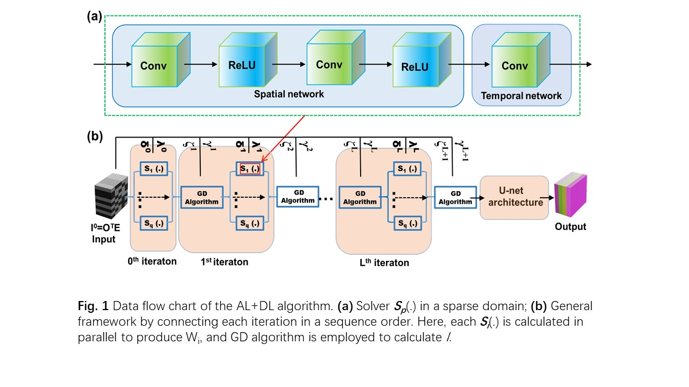
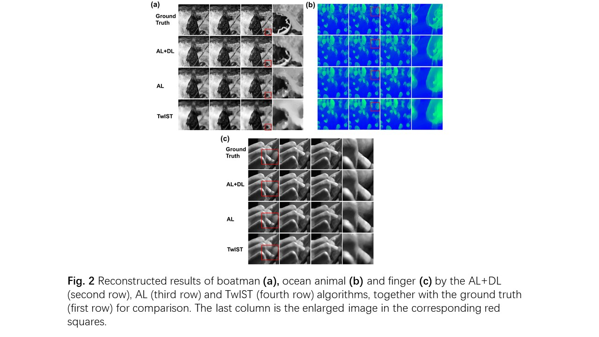
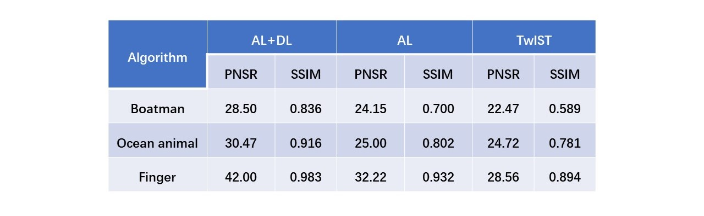
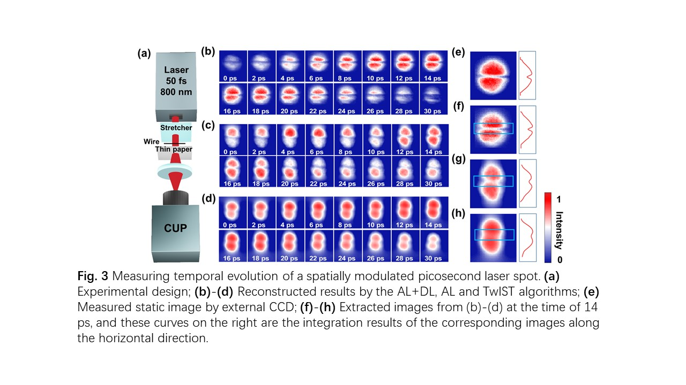
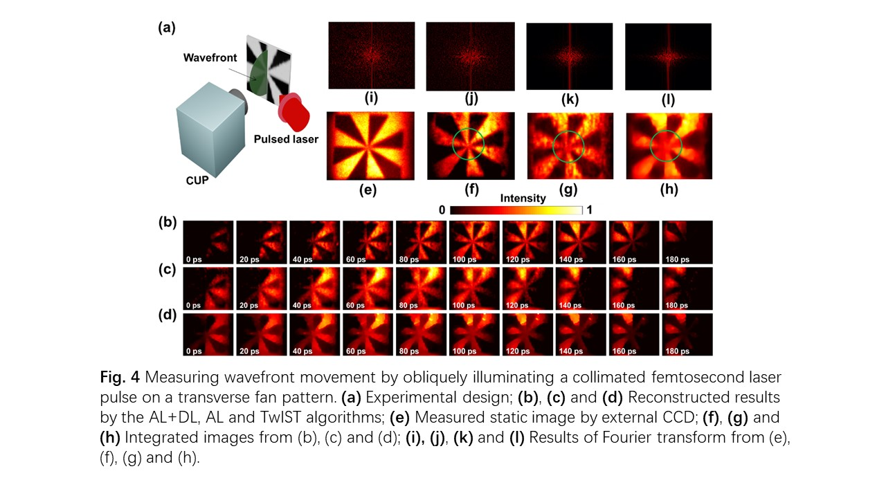

# ALDL-algorithm
###  This is codes about ALDL-algorithm, which is developed to realize high-fidelity image reconstruction for CUP. In this algorithm, there are four key points: (1) Optimizing the sparse domain in the multiple transformation; (2) Optimizing the relevant calculation parameters in the iteration process; (3) Employing GD algorithm to improve the computing efficiency; (4) Embedding the U-net architecture to help denoise. The thought of ALDL we borrowed from the references [24, 27-35]. 

Steps:
* 1, install tensorflow Tensorflow-gpu==1.13.1....
* 2, install python 3 .....
* 3, simulate the data: run the simulation_train.py(or simulation_train.m) in the for_simulation_data file;run the simulation_test.py (or simulation_test.m) in the /for_simulation_data/ folder. Here you can use python or matlab.
* 4, copy the Date.mat and Code.mat from the /for_simulation_data/train/boatman/ into the /Train_Data/Boatman/; copy the Date.mat and Code.mat from the /for_simulation_data/test/boatman/ into the /Test_Data/Boatman/
* 5, train the model: run the train.py in the AL-Unet-attention......
* 6, test the model: run the test.py in the AL-Unet-attention..... 

If you have any questions, please contact integrityyang@gmail.com
